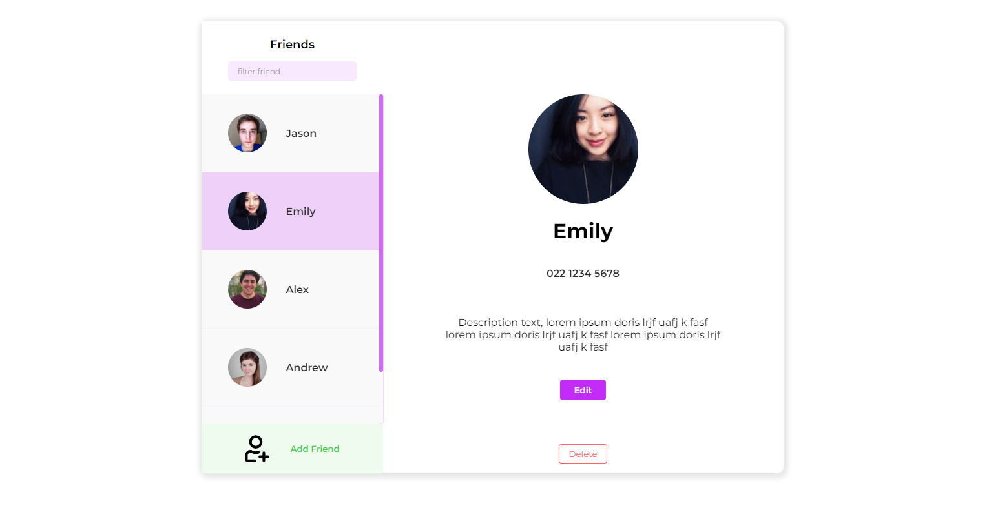

# WDCC - server-side JavaScript, Node.js, Express & APIs

The activity for this workshop will be based on a live demo working through and building an server side API (Application Programming Interface). The slides will cover fundamental concepts of API development which will then be practised in the practical component of this workshop. You will be exposed to basics behind the main communication protocol online websites use 🌍!

From binge watching shows, banking to that random google search, everything online uses an API of some sort 👩‍💻👨‍💻.

## Links:

* Link to slides: [https://tinyurl.com/wdcc-js-2025](https://tinyurl.com/wdcc-js-2025)
* Link to GitHub repo: [https://tinyurl.com/wdcc-js-2025-repo](https://tinyurl.com/wdcc-js-2025-repo)
* You will need to install Node.js: [nodejs.org](http://nodejs.org/)
* Suggested IDE: [code.visualstudio.com](http://code.visualstudio.com/)
* Postman: [postman.com](http://postman.com/) or can use Node.js Postman plugin

### WDCC Workshop Passport

Please scan 🤳the workshop passport link at your earliest convenience to support the team in attendance surveys 📈?

Link: 

## Task

Using NodeJS express, and the provided code in the `exercise` folder; Create an basic HTTP API which will **Create**, **Read**, **Update** and **Delete** data (CRUD) from a simulated database.

Look for `app.js` inside the `exercise/src` path. Follow along with the live demo as we complete each `TODO` task in the code.

As we approach this task, we'll be using a tool called Postman (there are alternatives) to interact with the API on the server. This is a form of manual testing to break something (possibly complex) into small chunks, being able to test and interact with code is important when working with server. Although installing NodeJS and running the code for the first time is just as important.

### Data Storage (Database) note

This server-side workshop simplifies possible unrelated errors by not using a proper database. This also means we need to **keep in mind data is reset between server restarts**. However, a mock database and data access functions have been included that simulate how a database would be accessed and modified through calls to JavaScript functions. Databases will be covered in a later workshop.

## Getting Help

The goal is to start running the code in the example folder with `npm run dev` command as soon as possible - thereby allowing you to start interacting with your server using HTTP API requests and hopefully getting some info back!

Feel free to ask for help as soon as we complete the brief lecture(s). The goal today is to have fun ✨ and learn at your own pace - make sure to reach out with help if you feel a little stuck 😊.

### Backup solutions

You have been provided with an `exercise-solution` directory which contains a version of the completed code in case you get stuck; however, the goal of the workshop is to work through step by step in order to build the server-side app and understand the process of creating it - everytime we find a bug - it's a great learning opportunity!

## End note

The HTTP API created in this workshop is designed to be the **backend** that connects to the **frontend** user interface that was prototyped in the HTML & CSS workshop, and the React user interface that you will create in the next workshop.

The final user interface that will be completed at the end of the workshop series will allow a user to interact with the full functionality of the API you will build in this workshop. It will look something like this at the end:

